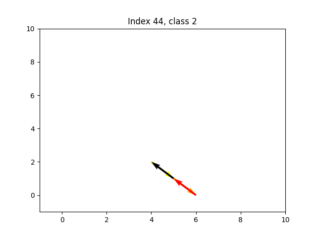

Michał Naruniec\
360386

# Deep Neural Networks
## Assignment 3

### Data analysis

This is a table with 10 samples from each class in the test set.
The arrows progress from the lightests (yellow) to the darkest one (black).

It's hard to notice a strong pattern, but it seems like the classes might represent moving towards particular corner of the lattice.
Class 0 seems to be trending towards the top-right corner, class 1 - top-left, class 2 - bottom-right, class 3 - bottom-left.

| Class 0 | Class 1 | Class 2 | Class 3 |
|:---:|:---:|:---:|:---:|
|  |  |  |  |
|  |  |  |  |
|  |  |  |  |
|  |  |  |  |
|  |  |  |  |
|  |  |  |  |
|  |  |  |  |
|  |  |  |  |
|  |  |  |  |
|  |  |  |  |

### Architecture

The network consists of two stacked layers of LSTM with 8 features in the hidden state, as well as a fully connected layer, transforming 8 features from last LSTM output to 4 class output.
I normalize the classes with softmax and use log-loss for the classification task.
There is additionally an embedding layer at the beginning for the second version of the assignment.

### Evaluation and embedding analysis

The network achieves around 69% accuracy on the test set both with and without embeddings.

#### Embedding analysis

| Original lattice | Trained embeddings|
|:---:|:---:|
|  |  |

In the visualization of the original lattice above, the corners have red, green, black and yellow colors, and the rest of nodes represent a fluid transition between them.
As you can see, the embeddings almost took a shape of a slightly shifted square. It's rotated and a bit like a rhombus, but it is okay, as the orientation (and probably all non-reductive linear transformations) should not matter for the task.
The important thing is that the color pattern of the points resembles the original one.

Below you can see the history of learning the embeddings as a GIF.

